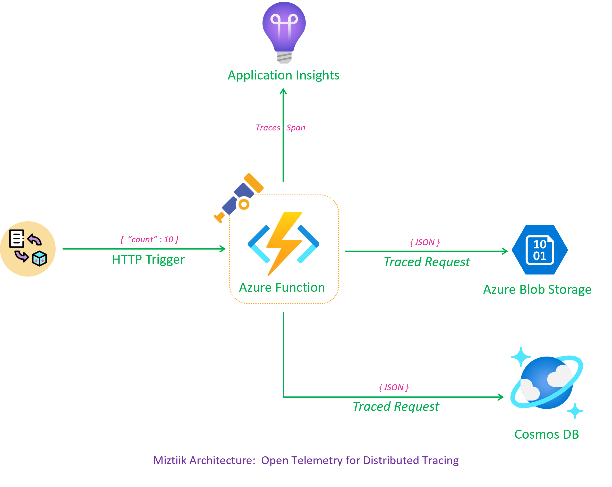
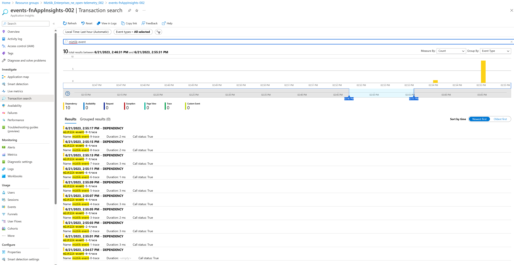
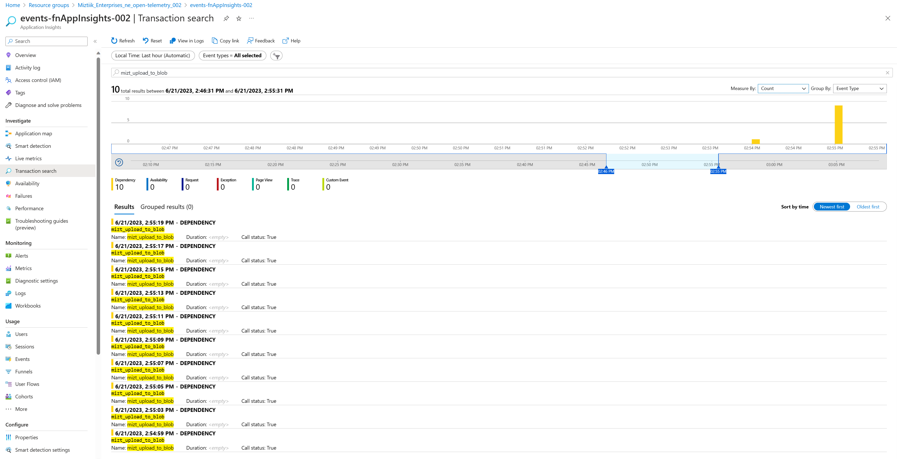
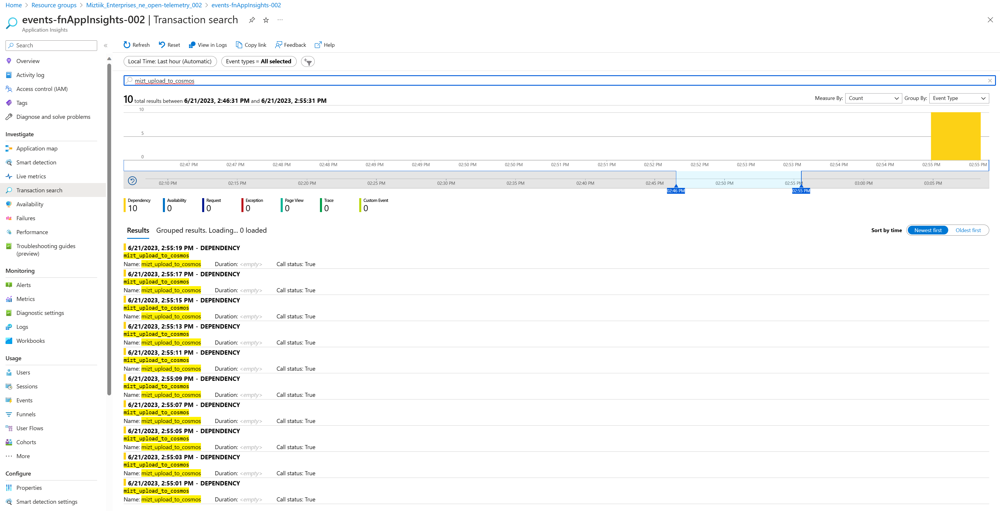
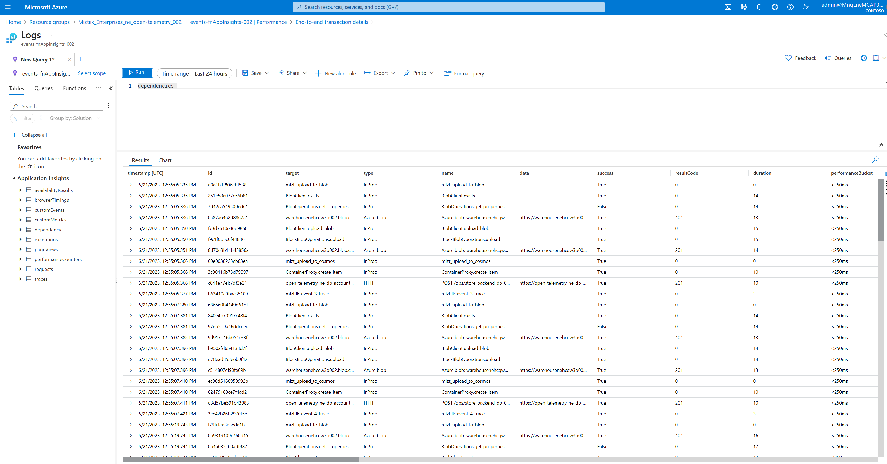

# Distributed Tracing with OpenTelemetry in Azure

Mystique Enterprise operates web stores that generate a large number of sales and inventory events across multiple locations. These events pass through various systems, and Azure Functions are responsible for processing them. The events are stored in blobs to ensure compliance and support audit requirements. Additionally, the events are persisted in Cosmos DB to facilitate the order orchestration process. However, there are occasional delays in event processing, and Mystique Enterprise wants to identify the root causes of these delays using distributed tracing.

Can you provide guidance on how to accomplish this?

## 🎯 Solution

To address delays in event processing and enable distributed tracing, Mystique Enterprise can utilize OpenTelemetry to trace events across systems. By instrumenting the code with OpenTelemetry and Azure Application Insights, telemetry data can be captured during event processing. This data can be analyzed using Azure Application Insights to identify areas causing delays and visualize the end-to-end flow of events, allowing for targeted performance optimization in the order processing workflow.

The code will create a trace `miztiik-event-*-trace` and a attribute of `event_id` for each event. When ever the event is persisted to blob a span like this `miztiik_upload_to_blob` will be created. Likewise when interacting with cosmos `miztiik_upload_to_cosmos`. Both these spans will have the following attributes, `event_typ` & `is_return`

Do note that what open telemetry calls a trace shows up a dependancy in App Insights. Checkout this doc for more details on the mapping - [OpenTelemetry to Application Insights mapping](https://learn.microsoft.com/en-us/azure/azure-monitor/app/opentelemetry-overview#opentelemetry)



1. ## 🧰 Prerequisites

   This demo, along with its instructions, scripts, and Bicep template, has been specifically designed to be executed in the `northeurope` region. However, with minimal modifications, you can also try running it in other regions of your choice (the specific steps for doing so are not covered in this context)

   - 🛠 Azure CLI Installed & Configured - [Get help here](https://learn.microsoft.com/en-us/cli/azure/install-azure-cli)
   - 🛠 Azure Function Core Tools - [Get help here](https://learn.microsoft.com/en-us/azure/azure-functions/functions-run-local?tabs=v4%2Cwindows%2Ccsharp%2Cportal%2Cbash#install-the-azure-functions-core-tools)
   - 🛠 Bicep Installed & Configured - [Get help here](https://learn.microsoft.com/en-us/azure/azure-resource-manager/bicep/install)
     - 🛠 [Optional] VS Code & Bicep Extenstions - [Get help here](https://learn.microsoft.com/en-us/azure/azure-resource-manager/bicep/install#vs-code-and-bicep-extension)
   - `jq` - [Get help here](https://stedolan.github.io/jq/download/)
   - `bash` or git bash - [Get help here](https://git-scm.com/downloads)

2. ## ⚙️ Setting up the environment

   - Get the application code

     ```bash
     git clone https://github.com/miztiik/azure-open-telemetry-tracing.git
     cd azure-event-hub-stream-processor
     ```

3. ## 🚀 Prepare the local environment

   Ensure you have jq, Azure Cli and bicep working

   ```bash
   jq --version
   func --version
   bicep --version
   bash --version
   az account show
   ```

4. ## 🚀 Deploying the Solution

   - **Stack: Main Bicep**
     We will create the following resources
     - **Storage Accounts** for storing the events
       - General purpose Storage Account - Used by Azure functions to store the function code
       - `warehouse*` -  Azure Function will store the events data in this storage account
     - **Managed Identity**
        - This will be used by the Azure Function to interact with other services
     - **Azure Cosmos DB**
        - This will be used by the Azure Function to store the events data
     - **Python Azure Functions**
        - **Producer**: `HTTP` Trigger. Customized to send `count` number of events to the service bus, using parameters passed in the query string. `count` defaults to `10`

      Initiate the deployment with the following command,

      ```bash
      # make deploy
      sh deployment_scripts/deploy.sh
      ```

      After successfully deploying the stack, Check the `Resource Groups/Deployments` section for the resources.

5. ## 🔬 Testing the solution

   - **Trigger the Event Producer function**

      ```bash
      PRODUCER_URL="https://open-telemetry-store-backend-ne-fn-app-002.azurewebsites.net/store-events-producer-fn"
      for i in {1..10}
      do
      echo "Sending event batch $i"
      curl $PRODUCER_URL?count=30 &
      sleep 5
      done
      ```

      You should see an output like this, We are sending batch of 30 events every 5 seconds. You can change the batch size and the interval between batches by changing the `count` and `sleep` parameters respectively.

      ```json
      Sending event batch 1
      [1] 2814
      Sending event batch 2
      [2] 2816
      Sending event batch 3
      [3] 2818
      Sending event batch 4
      ...
      ```

      As we are batching the upload of telemetry data to application insights, It takes few minutes for the data to show up there. You can check the `Live Metrics` section of the `store-events-producer-fn` function app. 

      
      
      
      
      

6. ## 📒 Conclusion

    In conclusion, this blog showcases the effective utilization of OpenTelemetry in conjunction with Azure services to enhance observability and performance optimization in event-driven architectures. By instrumenting the code with OpenTelemetry and integrating it with Azure Application Insights, Miztiik Enterprises gained valuable insights into the end-to-end flow of events, enabling them to identify and address delays in event processing. The seamless integration of OpenTelemetry with Azure services provides a powerful solution for distributed tracing, enabling developers to pinpoint bottlenecks and improve system performance. With the ability to capture and analyze telemetry data, Miztiik Enterprises can make informed decisions and optimize their event-driven workflows for enhanced fraud detection, data auditability, and overall operational efficiency.
  
7. ## 🧹 CleanUp

   If you want to destroy all the resources created by the stack, Execute the below command to delete the stack, or _you can delete the stack from console as well_

   - Resources created during [Deploying The Solution](#-deploying-the-solution)
   - _Any other custom resources, you have created for this demo_

   ```bash
   # Delete from resource group
   az group delete --name Miztiik_Enterprises_xxx --yes
   # Follow any on-screen prompt
   ```

   This is not an exhaustive list, please carry out other necessary steps as maybe applicable to your needs.

## 📌 Who is using this

This repository aims to show how to Bicep to new developers, Solution Architects & Ops Engineers in Azure.

### 💡 Help/Suggestions or 🐛 Bugs

Thank you for your interest in contributing to our project. Whether it is a bug report, new feature, correction, or additional documentation or solutions, we greatly value feedback and contributions from our community. [Start here](/issues)

### 👋 Buy me a coffee

[](https://ko-fi.com/Q5Q41QDGK) Buy me a [coffee ☕][900].

### 📚 References

1. [Azure Docs - Data Collection Basics of Azure Monitor Application Insights][2]
1. [Azure Docs - Enable Azure Monitor OpenTelemetry for .NET, Node.js, Python and Java applications][3]

[2]: https://learn.microsoft.com/en-us/azure/azure-monitor/app/opentelemetry-overview
[3]: https://learn.microsoft.com/en-us/azure/azure-monitor/app/opentelemetry-enable?tabs=python#PREVIEW

### 🏷️ Metadata


**Level**: 200

[100]: https://www.udemy.com/course/aws-cloud-security/?referralCode=B7F1B6C78B45ADAF77A9
[101]: https://www.udemy.com/course/aws-cloud-security-proactive-way/?referralCode=71DC542AD4481309A441
[102]: https://www.udemy.com/course/aws-cloud-development-kit-from-beginner-to-professional/?referralCode=E15D7FB64E417C547579
[103]: https://www.udemy.com/course/aws-cloudformation-basics?referralCode=93AD3B1530BC871093D6
[899]: https://www.udemy.com/user/n-kumar/
[900]: https://ko-fi.com/miztiik
[901]: https://ko-fi.com/Q5Q41QDGK